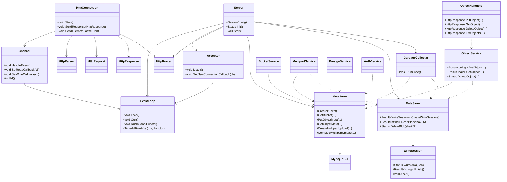
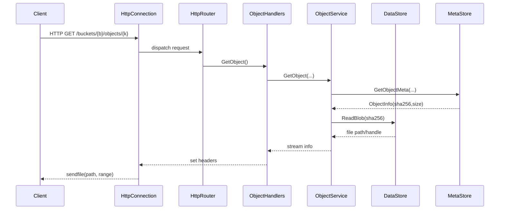
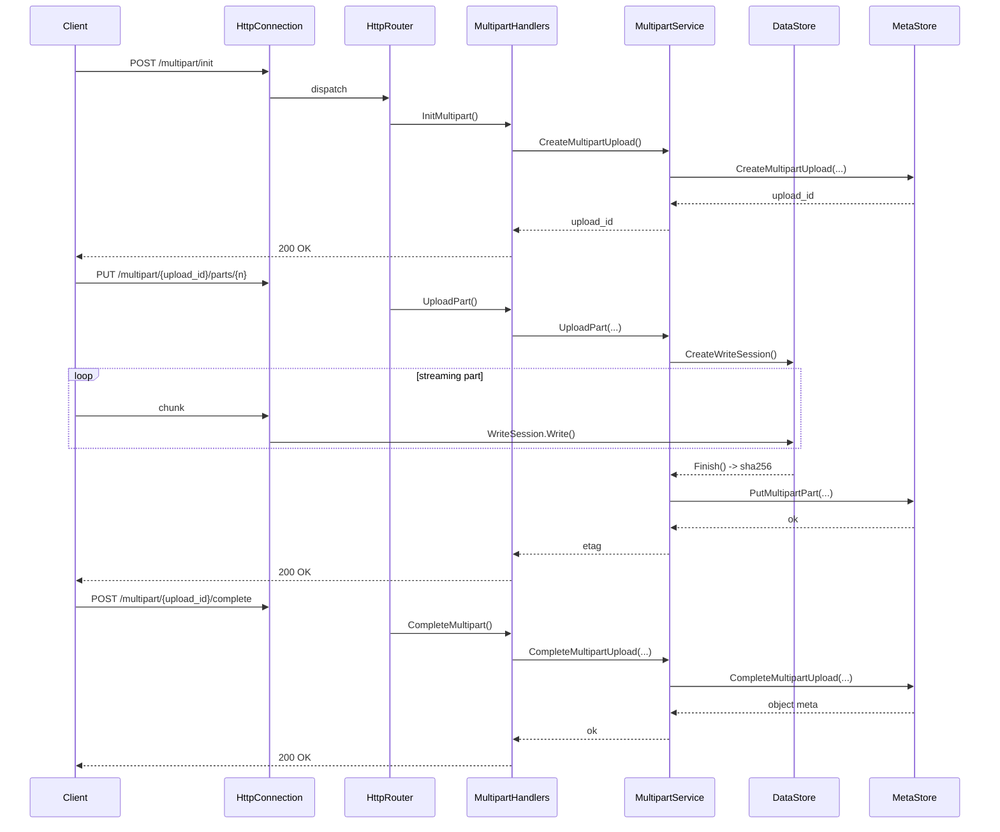

# MiniS3 UML（组件 / 类 / 时序）

> 说明：本文件基于当前代码结构与关键头文件生成，使用 Mermaid 语法渲染。

## 1. 组件图（模块依赖）

```mermaid
flowchart LR
    subgraph API[API 层]
        Router[HttpRouter]
        Handlers[Handlers
(bucket/object/multipart/health/presign)]
        Middleware[Middleware
(auth/trace)]
    end

    subgraph Net[网络层]
        Acceptor[Acceptor]
        EventLoop[EventLoop]
        Channel[Channel]
        HttpConn[HttpConnection]
        Parser[HttpParser]
        Request[HttpRequest]
        Response[HttpResponse]
        Buffer[ByteBuffer]
    end

    subgraph Service[服务层]
        BucketSvc[BucketService]
        ObjectSvc[ObjectService]
        MultipartSvc[MultipartService]
        PresignSvc[PresignService]
        AuthSvc[AuthService]
    end

    subgraph Storage[存储层]
        DataStore[DataStore]
        CasLayout[CasLayout]
        GC[GarbageCollector]
    end

    subgraph DB[元数据层]
        MySQLPool[MySQLPool]
        MetaStore[MetaStore]
    end

    subgraph Util[基础设施]
        Config[Config]
        Status[Status/Result]
        Crypto[Crypto(SHA256)]
        Logging[Logging]
        Metrics[Metrics]
        FS[FS]
    end

    subgraph Server[Server 进程]
        ServerCore[Server]
    end

    ServerCore --> Config
    ServerCore --> EventLoop
    ServerCore --> Acceptor
    ServerCore --> Router
    ServerCore --> MySQLPool
    ServerCore --> MetaStore
    ServerCore --> DataStore
    ServerCore --> GC

    Acceptor --> EventLoop
    EventLoop --> Channel
    Channel --> HttpConn
    HttpConn --> Parser
    HttpConn --> Request
    HttpConn --> Response
    HttpConn --> Buffer
    HttpConn --> Router

    Router --> Middleware
    Middleware --> Handlers
    Handlers --> Service

    BucketSvc --> MetaStore
    ObjectSvc --> MetaStore
    ObjectSvc --> DataStore
    MultipartSvc --> MetaStore
    MultipartSvc --> DataStore
    PresignSvc --> MetaStore
    AuthSvc --> MetaStore

    MetaStore --> MySQLPool
    DataStore --> CasLayout
    DataStore --> Crypto
    GC --> MetaStore
    GC --> DataStore

    ServerCore --> Logging
    ServerCore --> Metrics
```

## 2. 类图（核心类与关系）



## 3. 时序图（典型请求流程）

### 3.1 PUT Object（流式上传）

```mermaid
sequenceDiagram
    participant Client
    participant Acceptor
    participant Loop as EventLoop
    participant Conn as HttpConnection
    participant Router as HttpRouter
    participant Handler as ObjectHandlers
    participant Svc as ObjectService
    participant DS as DataStore
    participant MS as MetaStore

    Client->>Acceptor: TCP connect
    Acceptor->>Loop: new fd
    Loop->>Conn: create connection
    Client->>Conn: HTTP PUT /buckets/{b}/objects/{k}
    Conn->>Router: dispatch request
    Router->>Handler: PutObject()
    Handler->>Svc: PutObject(...)
    Svc->>DS: CreateWriteSession()
    loop streaming body
        Client->>Conn: body chunk
        Conn->>DS: WriteSession.Write()
    end
    DS-->>Svc: Finish() -> sha256
    Svc->>MS: PutObjectMeta(..., sha256)
    MS-->>Svc: ok
    Svc-->>Handler: etag/metadata
    Handler-->>Conn: 200 OK
    Conn-->>Client: response
```

### 3.2 GET Object（Range/零拷贝）



### 3.3 Multipart Upload（init -> upload part -> complete）



## 4. 关键类/文件索引（方便定位）

- 服务器核心：[src/server/server.h](src/server/server.h)
- Reactor 事件循环：[src/net/epoll/event_loop.h](src/net/epoll/event_loop.h)
- 连接与 HTTP：[src/net/http/http_connection.h](src/net/http/http_connection.h)
- 对象服务：[src/service/object_service.h](src/service/object_service.h)
- 元数据访问：[src/db/meta_store.h](src/db/meta_store.h)
- 数据存储：[src/storage/data_store.h](src/storage/data_store.h)
- 对象处理器：[src/api/handlers/object_handlers.h](src/api/handlers/object_handlers.h)

## 5. 类/成员/函数详解（按 UML 图中的核心类）

> 说明：以下内容基于头文件中的成员字段与接口说明，仅列出已在 UML 中出现的核心类。

### 5.1 Server

- 作用：进程级入口，初始化配置、线程池、路由、存储与数据库，并统一管理连接与生命周期。
- 成员变量：
    - config_：运行配置引用。
    - main_loop_ / acceptor_：主线程事件循环与监听器。
    - io_loops_ / io_threads_：IO 线程池与对应 EventLoop 集合。
    - next_loop_index_ / io_loops_mutex_ / io_loops_cv_ / io_loops_ready_：多线程调度与就绪同步。
    - connections_ / connections_mutex_：活跃连接集合及其保护锁。
    - uploads_ / uploads_mutex_：流式上传上下文表（每连接的写入状态）。
    - mysql_pool_ / meta_store_ / data_store_ / gc_：存储与元数据组件。
    - router_：HTTP 路由器。
    - running_：运行状态原子标记。
- 主要函数：
    - Init()：初始化组件（线程池/存储/路由/连接池）。
    - Start()：启动事件循环并进入阻塞运行。
    - Stop()：停止服务并清理资源。
    - SetupRoutes()：注册 API 路由与中间件。
    - OnNewConnection() / OnConnectionClose()：连接生命周期管理。
    - OnRequest() / OnBodyData()：请求与流式 body 的处理入口。
    - GetNextLoop()：轮询选择 IO 线程。
    - ShouldStreamUpload()：判断是否进入流式上传路径。

### 5.2 EventLoop

- 作用：Reactor 事件循环，负责 epoll 等待、任务投递与定时器驱动。
- 成员变量：
    - looping_ / quit_ / calling_pending_functors_：循环状态控制。
    - thread_id_：所属线程标识。
    - epoll_fd_：epoll 句柄。
    - notifier_：跨线程唤醒器。
    - timer_wheel_ / timer_fd_ / timer_channel_：定时器驱动与通道。
    - events_：epoll 返回事件缓存。
    - channels_：fd 到 Channel 的索引表。
    - mutex_ / pending_functors_：任务队列与保护锁。
- 主要函数：
    - Loop() / Quit()：进入/退出事件循环。
    - RunInLoop() / QueueInLoop()：执行或投递任务。
    - Wakeup()：唤醒 loop 线程处理任务。
    - RunAfter() / CancelTimer() / RefreshTimer()：定时任务管理。
    - UpdateChannel() / RemoveChannel() / HasChannel()：fd 事件注册管理。

### 5.3 Acceptor

- 作用：监听套接字，负责 accept 新连接。
- 成员变量：
    - loop_：所属 EventLoop。
    - listen_fd_ / port_：监听 fd 与端口。
    - channel_：监听 fd 的事件通道。
    - new_connection_callback_：新连接回调。
    - listening_：监听状态。
    - idle_fd_：用于处理 fd 耗尽时的保护 fd。
- 主要函数：
    - Listen()：开始监听。
    - HandleRead()：accept 新连接并回调。

### 5.4 Channel

- 作用：fd 与事件回调的绑定，封装 epoll 事件触发。
- 成员变量：
    - loop_ / fd_：所属循环与文件描述符。
    - events_ / revents_：注册与就绪事件。
    - index_：在 epoll 中的状态。
    - tie_ / tied_：生命周期绑定（防止回调期间对象被释放）。
    - event_handling_ / added_to_loop_：状态标记。
    - read_callback_ / write_callback_ / close_callback_ / error_callback_：各类事件回调。
- 主要函数：
    - HandleEvent()：根据 revents_ 分发事件。
    - EnableReading/Writing() 等：注册/取消关注的事件。
    - Remove()：从 EventLoop 中移除。
    - Tie()：绑定生命周期。

### 5.5 HttpConnection

- 作用：单连接 HTTP 生命周期管理，包含解析、流式 body 与 sendfile。
- 成员变量：
    - loop_ / sockfd_ / peer_addr_：所属循环、socket、对端地址。
    - channel_：连接 fd 对应通道。
    - state_：连接状态机。
    - parser_：HTTP 解析器。
    - input_buffer_ / output_buffer_：读写缓冲。
    - file_fd_ / file_offset_ / file_remaining_：sendfile 相关状态。
    - close_callback_ / request_callback_ / body_data_callback_：回调函数。
    - idle_timer_id_ / idle_timeout_：空闲超时管理。
    - max_body_bytes_：请求体大小限制。
- 主要函数：
    - Start() / Close() / ForceClose()：连接生命周期。
    - Send()：发送普通响应。
    - SendFile()：发送文件（支持 range）。
    - HandleRead/Write/Close/Error()：事件处理入口。
    - ProcessHeaders() / ProcessBodyData()：解析请求与流式处理。
    - SetIdleTimeout()/RefreshIdleTimer()：超时控制。
    - SetSocketBufferSizes()：调优 socket 缓冲区。

### 5.6 HttpRequest

- 作用：表示已解析的 HTTP 请求。
- 成员变量：
    - method_ / path_ / query_ / version_：请求行信息。
    - headers_：请求头集合。
    - body_：小请求的 body 缓存。
    - path_params_：路由路径参数。
    - query_params_ / query_parsed_：查询参数缓存与解析标记。
    - trace_id_ / client_ip_：上下文信息。
- 主要函数：
    - AddHeader()/SetHeader()/GetHeader()：头部管理。
    - ContentLength()/ContentType()/Host()/IsKeepAlive()：常用头部快捷访问。
    - SetPathParam()/GetPathParam()：路由参数读写。
    - GetQueryParam()：查询参数访问（懒解析）。
    - Reset()：复用连接时重置状态。

### 5.7 HttpResponse

- 作用：响应构造与序列化，支持文件与 JSON。
- 成员变量：
    - status_code_ / status_message_：状态信息。
    - headers_：响应头。
    - body_：响应体（小响应）。
    - file_path_ / file_size_ / file_offset_ / file_length_：文件响应参数。
    - keep_alive_：连接保持。
- 主要函数：
    - SetStatusCode()/SetStatusMessage()：设置状态。
    - SetHeader()/AddHeader()：头部管理。
    - SetBody()/AppendBody()：响应体操作。
    - SetJsonBody()：JSON 响应。
    - SetFile()/SetFileRange()：文件响应（支持 range）。
    - AppendToBuffer()：序列化响应头到缓冲区。
    - Ok/Json/Error/NotFound...：常用构造器。

### 5.8 HttpParser

- 作用：流式解析 HTTP/1.1 请求。
- 成员变量：
    - state_：解析状态机。
    - request_：当前请求对象。
    - error_message_：解析错误信息。
    - content_length_ / remaining_body_length_：body 长度与剩余字节。
    - chunked_ / current_chunk_size_ / reading_chunk_size_：chunked 解析状态。
- 主要函数：
    - Parse()：从 ByteBuffer 解析数据。
    - Reset()：连接复用重置。
    - HasBody()/IsChunked()：判断 body 与编码。
    - ConsumeBody()：流式消费 body 字节。

### 5.9 HttpRouter

- 作用：路由匹配与中间件链执行，支持路径参数。
- 成员变量：
    - routes_：路由表（方法/模式/regex/参数名/处理器）。
    - middlewares_：全局中间件列表。
    - not_found_handler_：404 处理函数。
- 主要函数：
    - Route()/Get()/Post()/Put()/Delete()/Head()：注册路由。
    - Use()：注册中间件。
    - Handle()：匹配请求并执行中间件链与处理器。

### 5.10 MetaStore

- 作用：元数据持久化访问层（Bucket/Object/CAS/Multipart/幂等性）。
- 成员变量：
    - pool_：MySQL 连接池引用。
- 主要函数（按领域分组）：
    - Bucket：CreateBucket/GetBucket/GetBucketById/ListBuckets/DeleteBucket/IsBucketEmpty。
    - Object：PutObject/PutObjectWithRefCount/GetObject/GetObjectVersion/ListObjects/DeleteObject/DeleteObjectWithRefCount/DeleteObjectVersion。
    - CAS Blob：RegisterCasBlob/GetCasBlob/IncrementRefCount/DecrementRefCount/DecrementRefCountAndCheckZero/DecreaseCasBlobRefCount/GetGarbageBlobs/DeleteCasBlob。
    - Multipart：CreateMultipartUpload/GetMultipartUpload/DeleteMultipartUpload/ListMultipartUploads/CreateOrUpdatePart/PutPartWithRefCount/PutPart/ListParts/CompleteMultipartUpload/AbortMultipartUpload。
    - 幂等性：CheckIdempotency/RecordIdempotency/CleanupIdempotencyRecords。
    - 辅助：Escape/ParseTimestamp/GenerateVersionId。

### 5.11 MySQLConnection / MySQLPool / PooledConnection

- MySQLConnection 作用：单连接封装。
    - 成员：mysql_（底层句柄）。
    - 方法：Connect/Disconnect/IsValid/Ping/Execute/Query/LastInsertId/AffectedRows/LastError/Escape。
- MySQLPool 作用：连接池。
    - 成员：config_ / connections_ / mutex_ / cv_ / closed_ / active_count_。
    - 方法：Init/Close/GetConnection(含超时)/AvailableCount/TotalCount。
- PooledConnection 作用：连接池 RAII 封装。
    - 成员：conn_（共享连接）。
    - 方法：operator-> / operator* / IsValid。

### 5.12 DataStore / WriteSession / CasLayout

- WriteSession 作用：流式写入会话，边写边计算 SHA256。
    - 成员：tmp_path_ / fd_ / bytes_written_ / sha256_ctx_ / finished_。
    - 方法：Write/Finish/Abort/BytesWritten/TmpPath。
- DataStore 作用：基于 CAS 的数据读写与合并。
    - 成员：layout_ / tmp_dir_。
    - 方法：Init/BeginWrite/CommitWrite/Write/Read/StreamRead/GetFilePath/Exists/GetSize/Delete/Merge/Layout。
- CasLayout 作用：根据 sha256 生成存储路径。
    - 成员：base_dir_。
    - 方法：GetCasPath/GetCasDir/BaseDir/IsValidCasKey。

### 5.13 GarbageCollector

- 作用：异步清理 ref_count=0 的 CAS blob。
- 成员变量：
    - meta_store_ / data_store_：元数据与存储引用。
    - interval_seconds_ / batch_size_：回收周期与批量大小。
    - gc_thread_ / running_：后台线程与状态。
    - mutex_ / cv_ / pending_deletes_：任务队列与同步。
    - delete_callback_：删除后回调（更新元数据）。
- 主要函数：
    - Start()/Stop()：线程生命周期。
    - AddPendingDelete(s)/QueueLength()/RunOnce()：任务管理。
    - GCLoop()/ProcessBatch()：内部清理逻辑。

### 5.14 Service 层

- BucketService：封装 bucket 业务。
    - 成员：meta_store_。
    - 方法：CreateBucket/DeleteBucket/BucketExists/GetBucket/ListBuckets。
- ObjectService：封装 object 业务与 CAS 写入。
    - 成员：meta_store_ / data_store_。
    - 方法：PutObject/GetObject/GetObjectRange/DeleteObject/ObjectExists/HeadObject/ListObjects/CopyObject。
- MultipartService：封装分片上传业务。
    - 成员：meta_store_ / data_store_。
    - 方法：InitiateMultipartUpload/UploadPart/CompleteMultipartUpload/AbortMultipartUpload/ListParts/ListMultipartUploads/GetMultipartUpload。
- PresignService：预签名 URL 生成与校验。
    - 成员：auth_service_ / base_url_。
    - 方法：GenerateGetUrl/GeneratePutUrl/ValidatePresignUrl/BuildPresignUrl。
- AuthService：认证与签名。
    - 成员：static_tokens_。
    - 方法：ValidateToken/ValidateApiKey/ValidatePresign/GeneratePresignSignature。

### 5.15 Handlers 层

- BucketHandlers：纯静态处理函数，封装 HTTP 到服务的转换。
    - 方法：CreateBucket/GetBucket/DeleteBucket/ListBuckets。
- ObjectHandlers：对象相关 HTTP 接入与 Range 解析。
    - 方法：PutObject/GetObject/HeadObject/DeleteObject/ListObjects/ParseRange。
- MultipartHandlers：分片上传 HTTP 接入。
    - 方法：InitUpload/UploadPart/CompleteUpload/AbortUpload/ListParts。
